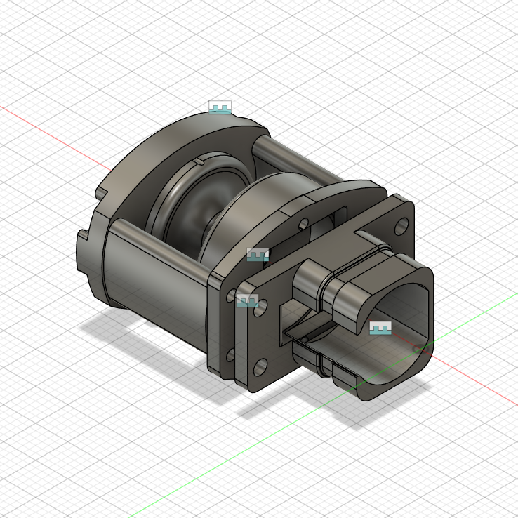
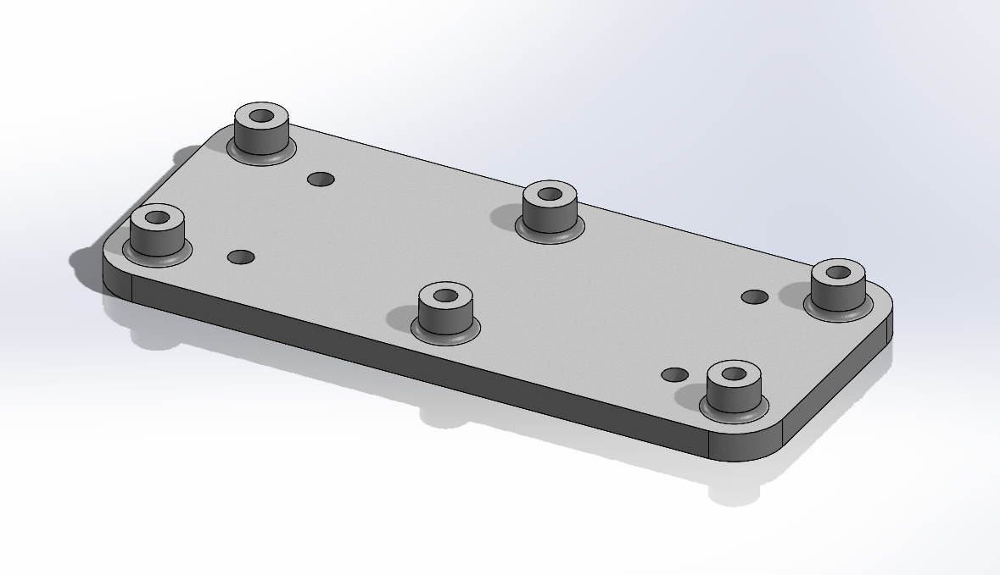
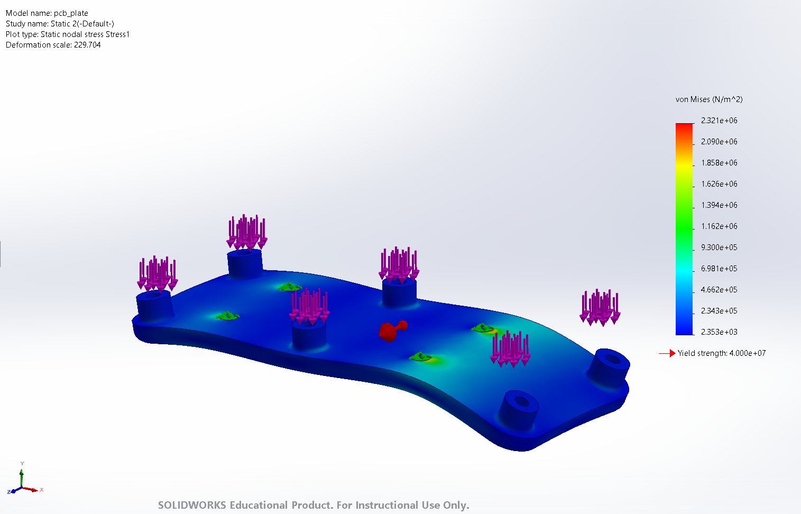
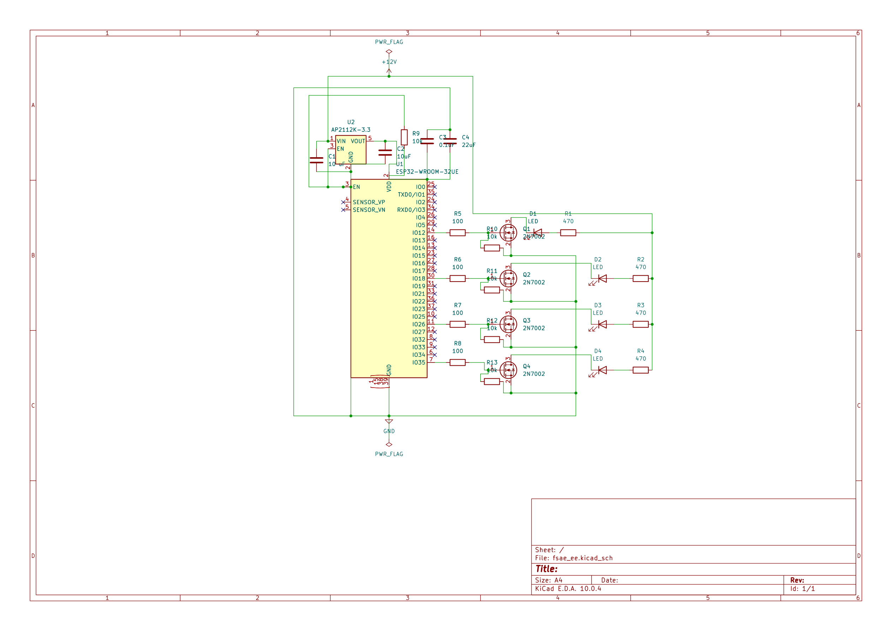
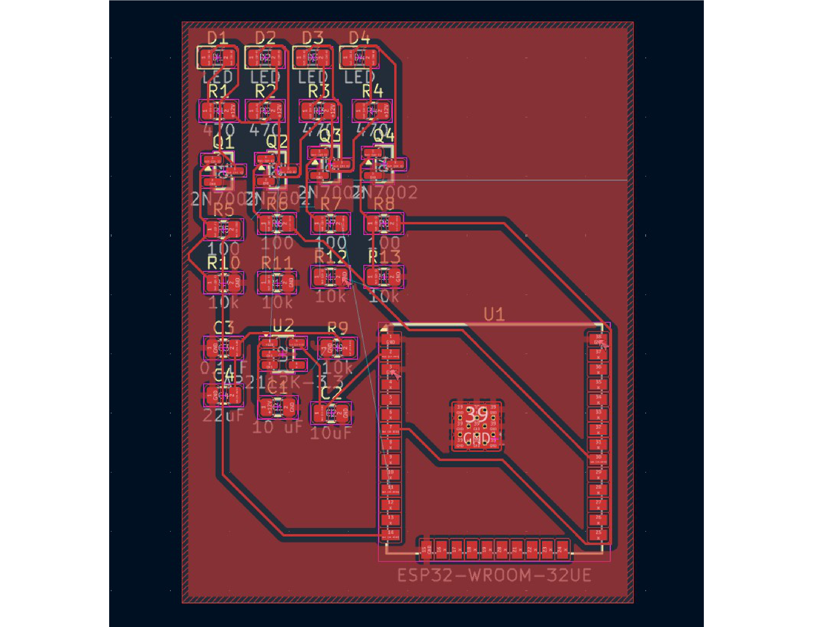
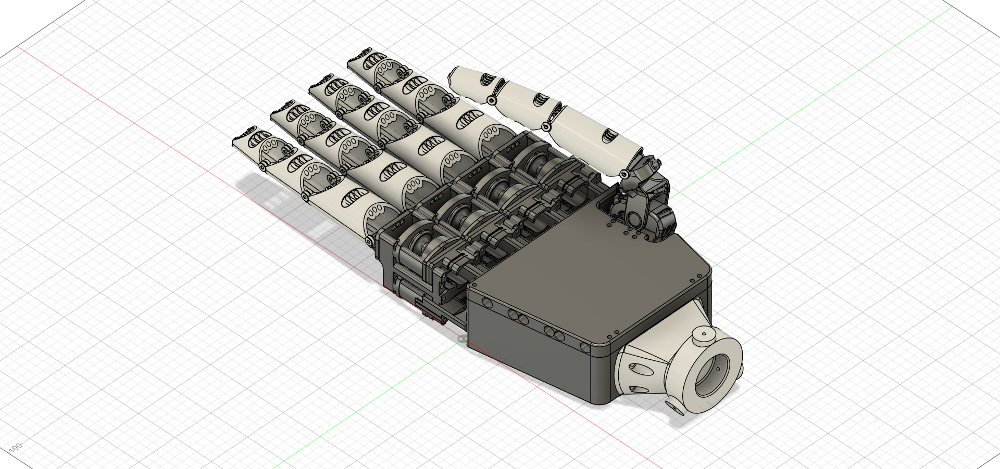
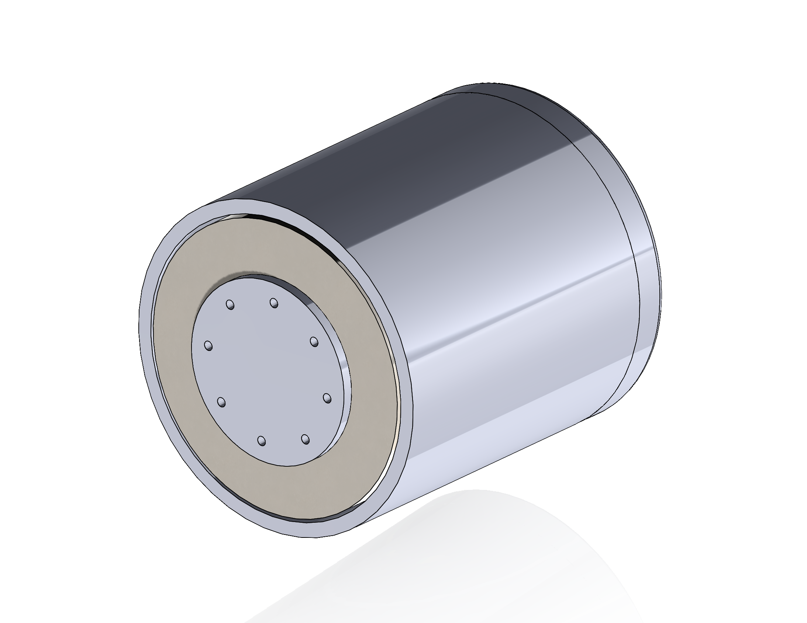
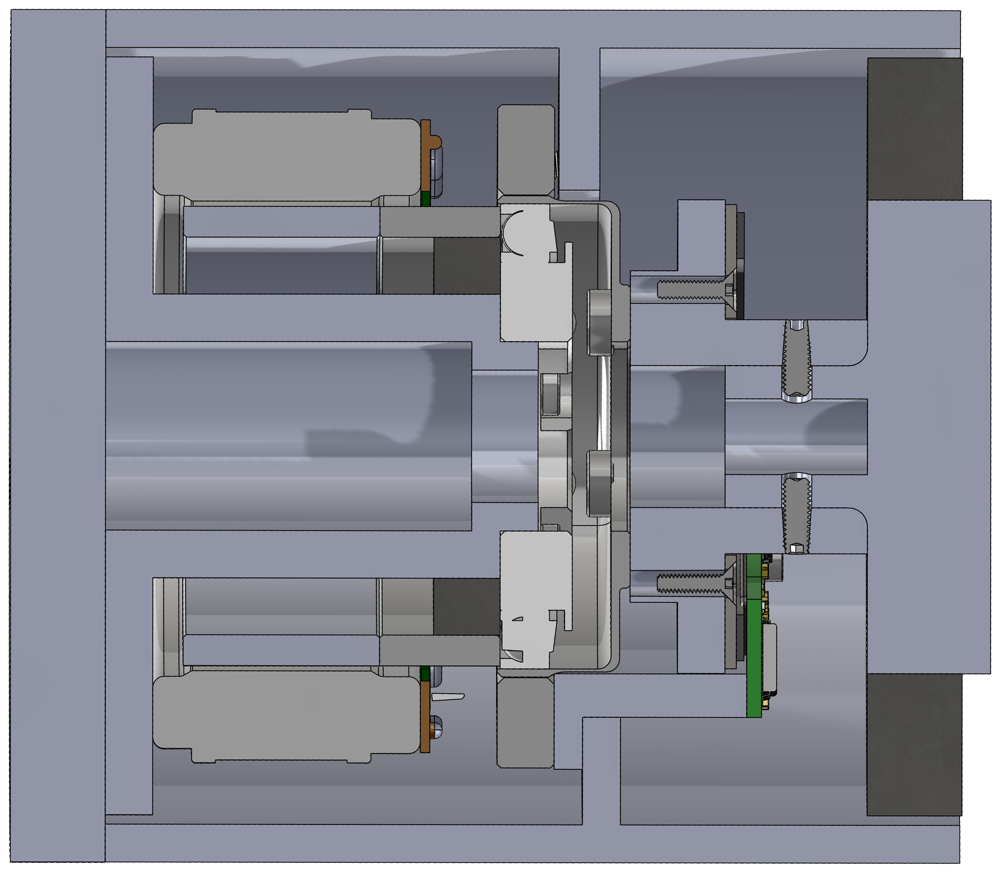

# Hi, I'm Pratik Nudurupati

Mechanical design engineer focused on actuators, robotics, and structural/FEA analysis. Biomedical Engineering student at UC Irvine — hands-on work skews mechanical: precision drivetrains, compliant mounts, and embedded control for mechatronic systems.

pratiknudurupati@gmail.com

---

## Featured Projects

### Bidirectional Twisted-String Actuator — Evodyne Robotics
Derived and built a differential tendon-drive actuator, solving for the zero-slack take-up condition analytically before cutting any parts.

- Derived the take-up relation R(θ) = dΔL/dθ governing a differential twisted-string drive
- Held 1:1 spur gears and concentric pulleys to <0.05 mm to eliminate backlash across a full 180° range
- **Result:** 0.26 N·m continuous bidirectional torque, 46% smaller package and 6% better torque-to-weight than the prior design

---

### Compliant PCB Mount — FSAE Anteater Electric Racing
Designed a TPU isolation mount to protect a control PCB from vibration and shock loads on a formula-style EV chassis.

- FEA-validated compliant mount cutting shock transmission ~95% under a 20g impulse
- Peak stress 2.32×10⁶ N/m² against a 4×10⁷ N/m² material yield — 17x margin

---

### ESP32 Progressive Shift-Light Controller — AER Electronics
Embedded firmware and PCB for a 4-LED progressive shift light with gear-aware RPM thresholding.

- Gear-inferred RPM thresholding (shift point scales with detected gear, not a fixed RPM)
- Hysteresis-tuned MOSFET switching to eliminate LED flicker near threshold
- Full stack: schematic, PCB layout, and C firmware

---

### Robotic Hand
Gear-driven transmission housing individually actuated fingers, designed for compact packaging within a hand-scale envelope.

---

### Robot-Joint Actuator (Motor + Harmonic Drive + Encoder Integration)
Personal CAD design study integrating three COTS mechatronic components into a single robot-arm-joint actuator: a frameless torque motor, a strain-wave (harmonic drive) reducer, and an off-axis absolute encoder.

- Designed the input shaft as the load-bearing interface part, stepping between the motor rotor bond diameter and the reducer's wave-generator bore (H7 fit)
- Selected and sized an output bearing (cross-roller/duplex angular-contact) to support the joint's radial, axial, and moment loads — the one interface not defined by either COTS datasheet
- Full stack-up: custom input shaft, motor-side and output-side housings, output flange, encoder readhead bracket, seals and service routing
- Deliverables: isometric assembly view, cross-section view, and STEP export

